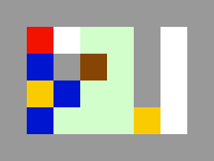

# About the Game
In the game, you are a red square and have to get the box (brown) to the lower right corner. Obstacles include falling stones (blue), walls (gray), and a lock (yellow, right) that can be unlocked with the key (yellow, left). You can push one stone or box at a time, and only if it is not falling. The flux (greenish) holds up boxes and stones but can be 'eaten' by the player. 

# How to Build It
Assuming that you have the Typescript compiler installed: Open a terminal in this directory, then run `tsc`. There should now be a `index.js` file in this directory.

# How to Run It
To run the game you need to first build it, see above. Then simply open `index.html` in a browser. Use the arrows to move the player.